# Sponza GI Lab

Laboratorio de juguete en three.js (WebGPU) para comparar métodos de **iluminación global difusa**
sobre Sponza, en costo (ms de GPU por pase, rayos, memoria) y en calidad (error contra una
referencia path-traced).

> **Importante — trazado de rayos por software.** WebGPU no expone los RT cores de la GPU. Todo el
> trazado de rayos de este proyecto (referencia, DDGI, cache hash, ReSTIR) recorre un BVH en
> *compute shaders*. Los tiempos sirven para **comparar los métodos entre sí** en este entorno;
> **no** predicen el rendimiento de esos métodos con trazado por hardware (DXR/Vulkan RT), donde el
> costo relativo de un rayo frente al de un pase de pantalla cambia mucho.

## Requisitos

- Node ≥ 20, npm.
- Un navegador con WebGPU. Probado con Chrome/Chromium en Fedora (Wayland) con una RTX 4060 Ti
  (driver NVIDIA 580, Vulkan).

### WebGPU en Chrome sobre Linux

En Linux, WebGPU sigue detrás de flags en Chrome estable. Abre `chrome://gpu` y busca
**WebGPU: Hardware accelerated**. Si dice *Disabled* o *Software only*:

1. `chrome://flags/#enable-unsafe-webgpu` → **Enabled**
2. `chrome://flags/#enable-vulkan` → **Enabled**
3. Reinicia Chrome y vuelve a mirar `chrome://gpu`.

Equivalente por línea de comandos:

```sh
google-chrome --enable-unsafe-webgpu --enable-features=Vulkan --use-angle=vulkan
# Chrome Dev en Flatpak:
flatpak run com.google.ChromeDev --enable-unsafe-webgpu --enable-features=Vulkan --use-angle=vulkan
```

En la consola de DevTools, `(await navigator.gpu.requestAdapter()).info` debería mostrar
`vendor: "nvidia"`, `architecture: "lovelace"`. Para medir tiempos de GPU hace falta la feature
`timestamp-query` (disponible con esos flags). Sin ella, el HUD cae a tiempos de CPU y lo indica.

## Uso

```sh
npm install
npm run fetch-assets   # descarga Sponza (~50 MB) a public/assets/sponza
npm run dev            # http://localhost:5173
```

Controles: `1`–`7` método, `0` referencia, `Shift+1`–`5` bookmarks de cámara, `V` modo de vista,
`S` split A|B, `R` reinicia el historial temporal, `H` oculta el HUD. El resto de los parámetros
está en el panel lil-gui.

`npm run capture` abre la app en Chromium headless (Playwright) sobre la GPU real y guarda
capturas; ver `scripts/capture.mjs`.

## Escena y licencia

Sponza viene de [KhronosGroup/glTF-Sample-Assets](https://github.com/KhronosGroup/glTF-Sample-Assets/tree/main/Models/Sponza).
© 2016 Crytek, bajo la *Cryengine Limited License Agreement*; modelo original de Marko Dabrovic
(2002), versión mejorada de Frank Meinl (Crytek, 2010), texturas PBR de Alexandre Pestana, con
correcciones de Morgan McGuire. Los metadatos son CC-BY 4.0. Por esa licencia el modelo **no se
versiona en este repositorio**: `npm run fetch-assets` lo descarga y copia junto al modelo su
`README.md`, `LICENSE.md` y el texto de la licencia (`LicenseRef-CRYENGINE-Agreement.txt`).

## Arquitectura

```
src/
  app.ts                 bucle de frame, selección de métodos, referencias, HUD/GUI, API de automatización
  scene/                 carga de Sponza (→ Lambert), luces (sol + 2 puntuales + cielo), bookmarks
  render/                G-buffer MRT, composición, display (split, diferencias, tonemap),
                         filtro temporal y à-trous compartidos
  rt/                    BVH + librería WGSL de trazado; helpers de kernels de compute
  gi/                    un módulo por método (interfaz GIMethod en gi/types.ts)
  metrics/               timer de GPU por pase, error contra referencia, memoria, caché de referencias
  bench/benchmark.ts     modo benchmark
scripts/                 descarga de assets, capturas/benchmark con Playwright, reporte
```

- **G-buffer** (MRT, `render/gbuffer.ts`): radiancia directa (rgba16f), albedo lineal, normal en
  espacio de vista y profundidad float32. La posición se reconstruye a partir de la profundidad.
- **Luz directa común**: sol direccional con shadow map de 4096², y dos luces puntuales con
  sombras cúbicas (una fija en la galería y otra que se mueve por el atrio). Los materiales son
  Lambert: se descarta el especular a propósito.
- **Cielo analítico** (gradiente horizonte → cenit, se atenúa con la hora). Lo ven los píxeles de
  fondo y los rayos indirectos que escapan; es parte de la señal de GI, no de la directa.
- **Interfaz `GIMethod`** (`gi/types.ts`): `init(ctx)`, `update(dt, info)`,
  `run(gbuffer, history) → textura`, `stats()`, `buildGui()`, `reset()`, `onCameraCut()`,
  `dispose()`. La textura que devuelve contiene la **iluminación indirecta difusa en la convención
  `E_ind/π`** (radiancia incidente media ponderada por coseno). El pase común
  (`render/composite.ts`) calcula `final = directa + albedo · indirecta` en HDR lineal. Eso es la
  radiancia saliente de una superficie Lambert, y es la imagen sobre la que se mide el error.
- **Librería de trazado** (`rt/rtScene.ts`): Sponza se hornea en una sola malla en espacio mundo
  (262 267 triángulos), con un BVH SAH de **three-mesh-bvh** empaquetado para WGSL por
  `BVHComputeData` (`three-mesh-bvh/webgpu`). Encima hay una librería WGSL común: closest hit
  (traversal `raycastFirstHit` de three-mesh-bvh), any-hit para rayos de sombra (shapecast propio
  que descarta todo después del primer impacto), irradiancia directa con visibilidad trazada
  (determinista para 3 luces, o con una sola luz elegida proporcional a su aporte), muestreo
  coseno, cielo, RNG PCG y contador de rayos con atómicos.
  - *three-mesh-bvh se usa como dependencia; three-gpu-pathtracer (que expone
    `three-gpu-pathtracer/webgpu` y usa esa misma traversal) se leyó como referencia, pero no se
    usa.* Su `WebGPUPathTracer` produce una imagen completa (especular, su propia luz directa con
    sombras trazadas, materiales PBR texturizados). Comparada contra este pipeline, el RMSE
    mezclaría diferencias que no son de GI. La referencia propia comparte G-buffer, luces, cielo
    y BVH con los demás métodos, así que lo que se mide es solo la aproximación de GI.
- **Medición de GPU por pase** (`metrics/gpuTimer.ts`): three.js r186 escribe un par de timestamps
  por *render pass* y por despacho de compute, con el UID `r|c:<llamada>:<id>:f<frame>`.
  `GpuTimer` anota qué llamadas pertenecen a cada pase con nombre, resuelve con
  `renderer.resolveTimestampsAsync()` y suma por pase. Los pases anidados (shadow maps dentro del
  G-buffer, el pase interno de GTAONode/SSGINode) quedan dentro del pase externo.

## Métodos

| Tecla | Método | Resumen |
|---|---|---|
| 0 | Referencia | Path tracer progresivo desde la superficie del G-buffer: muestreo coseno, NEE de una luz por vértice, cielo al escapar, ruleta rusa desde el 3.er rebote, hasta 8 rebotes. Acumula mientras cámara y luces están quietas. Las imágenes por bookmark y estado de luz se guardan en GPU + IndexedDB. |
| 1 | Sin GI | Ambiente constante teñido de cielo. |
| 2 | GTAO | Ambiente × AO de `GTAONode` (three.js) + filtro temporal. |
| 3 | SSGI | `SSGINode` (SSILVB) alimentado con la composición del frame anterior (multi-rebote) + ambiente × AO para la luz fuera de pantalla + filtro temporal. |
| 4 | DDGI | Grilla de probes (16×8×16 por defecto) sobre el bounding box de la escena. Cada frame traza una fracción round-robin (1/4 por defecto), con rayos por probe en múltiplos de 64 (128 por defecto) en espiral de Fibonacci rotada al azar. Irradiancia octaédrica 6×6 y momentos de distancia 14×14 con borde, histéresis (0.97), rebote infinito leyendo el volumen anterior, clasificación por fracción de impactos de cara trasera, test de Chebyshev y sesgos normal/vista. |
| 5 | DDGI + SSDO | DDGI × GTAO de radio corto (contacto), con filtro temporal propio y el ajuste multi-rebote de Jimenez et al. |
| 6 | Cache hash (SHaRC) | Tabla hash de 2^20 entradas (18–22 configurable): voxel en espacio mundo con LOD según la distancia × normal cuantizada, sondeo lineal con checksum. *Update*: paths de hasta 3 rebotes desde 1 de cada 16 píxeles, con NEE y cola del path cerrada con el cache, acumulación hacia atrás con atómicos de punto fijo. *Resolve*: media móvil con tope de muestras y desalojo de entradas viejas. *Query*: 1 rayo por píxel con lookup (si falta la entrada, solo luz directa en el impacto). Después à-trous (4 iteraciones, paradas por normal y plano) y acumulación temporal opcional. |
| 7 | ReSTIR GI | Opcional, hito (h): no implementado todavía. |

## Medición

- **Tiempo de GPU por pase**: ver arriba. El HUD muestra el promedio móvil por pase. El benchmark
  guarda media, mediana y p95 por frame.
- **Calidad** (`metrics/error.ts`): RMSE (lineal, RGB) y error relativo L1 de luminancia
  (`Σ|Y−Y_ref| / ΣY_ref`) de la imagen compuesta contra la composición de referencia del mismo
  bookmark y estado de luz, en HDR lineal y antes del tonemapping, sin contar los píxeles de
  cielo. Una reducción en compute por bloques de 16×16 se lee de forma asíncrona. La vista
  "diferencia" muestra `|ΔY|` con una rampa de calor (la ganancia es ajustable).
- **Piso de ruido de la referencia**: se genera una segunda referencia independiente y el error
  entre ambas, dividido por √2, estima el error de la referencia contra la verdad.
- **Respuesta dinámica**: el sol pasa de 13:30 a 9:30 y se registra el error frame a frame
  contra la referencia del nuevo estado. Se reportan **t90** (frames hasta recorrer el 90 % del
  camino entre el error justo después del cambio y el error estable) y los frames hasta bajar de
  un umbral absoluto (10 %). En vivo, el HUD muestra cuántos frames tardó en bajar del umbral
  tras el último cambio de luz. Para animar sol y luz puntual, usa el panel "Luces".
- **Memoria**: cada método declara sus texturas y buffers (tamaños calculados a partir de
  dimensiones y formatos), y se contrasta con el delta de `renderer.info.memory.total` al
  crearlo. El BVH (14.5 MiB) se reporta aparte porque lo comparten todos los métodos con rayos.
- **Modo benchmark** (`npm run bench`, o el botón en el panel): genera las referencias que falten
  (2048 spp; quedan guardadas en IndexedDB), calibra los parámetros libres de los métodos 1–3,
  recorre métodos × bookmarks (300 frames de calentamiento + 600 medidos), hace la prueba
  dinámica, mide el costo de la referencia y saca la galería de imágenes. Escribe
  `results/benchmark.json`, `results/benchmark.csv` y `results/passes.csv`, y regenera la sección
  de resultados de este README (`npm run bench:report`).

## Supuestos y desvíos documentados

- La luz directa se evalúa al llenar el G-buffer y no en un pase de iluminación diferido aparte,
  porque three.js liga las sombras y las luces a los materiales. Es idéntica para todos los métodos.
- Resolución interna fija de 1280×720 (el canvas se escala con CSS), para que los benchmarks no
  dependan del tamaño de la ventana.
- **Hits secundarios simplificados**, igual para la referencia y para todos los métodos con
  rayos: albedo **promedio por material** (textura promediada en lineal, ponderada por alpha en
  los materiales con máscara), normales de vértice sin normal map, y follaje opaco (el alpha-test
  existe solo en el raster).
- Las sombras de la luz directa son shadow maps (PCF de three.js); la visibilidad de las luces en
  los hits secundarios es trazada.
- **Parámetros libres calibrados**: la intensidad del ambiente (métodos 1–3) y la escala de
  `SSGINode` (SSILVB no está normalizado radiométricamente) se calibran con búsqueda en grilla
  contra la referencia. Es un ajuste con oráculo que **favorece** a esos métodos. Los métodos con
  rayos usan sus valores por defecto.
- "SSDO" se implementa como GTAO de radio corto con multi-rebote (oclusión direccional de corto
  alcance), no como el SSDO original de Ritschel et al. con rebote de color.
- DDGI no tiene reubicación de probes: los probes dentro de muros se desactivan por la fracción de
  impactos de cara trasera.
- El cache hash usa claves de 32 bits + checksum de 32 bits (SHaRC usa claves de 64 bits) y no
  tiene un pase de compactación.
- Los tiempos se miden en Chromium headless (Playwright) sobre la GPU real, con
  `--enable-unsafe-webgpu --enable-features=Vulkan`. Los frames siguen el `requestAnimationFrame`
  del navegador (vsync). Los tiempos de GPU no dependen de eso, pero el boost de la GPU sí puede
  variar entre corridas.

### Diferencias de API respecto de lo supuesto en el pedido

- `renderer.resolveTimestampsAsync()` existe, pero devuelve solo el total del frame. El tiempo por
  pase se obtiene de los UIDs por contexto del `TimestampQueryPool` de three (ver `GpuTimer`).
- `three-gpu-pathtracer` sí tiene versión WebGPU (`three-gpu-pathtracer/webgpu`, `WebGPUPathTracer`),
  pero por lo explicado arriba no se usa para la referencia.
- `GTAONode` y `SSGINode` existen en r186 (`three/addons/tsl/display/`) y se usan tal cual.
- `three-mesh-bvh/webgpu` expone `BVHComputeData` (marcado como API inestable) con la traversal
  WGSL. Sus helpers `wgslTagFn`, `rayStruct`, etc. no traen tipos; hay declaraciones locales en
  `src/types/`.
- `PostProcessing` se llama ahora `RenderPipeline` en r186. No se usa: los pases se encadenan a
  mano para poder medirlos uno por uno.
- `active` es palabra reservada en WGSL. TypeScript instalado: 7.0 (el compilador nativo); el
  typecheck es `tsc --noEmit`.

## Resultados

<!-- BENCH:START -->
Medido el 2026-10-03 · nvidia lovelace · three r186 · 1280×720 · 300 frames de calentamiento + 600 medidos por método y cámara · referencia 2048 spp · tiempos de GPU por timestamp queries.

| # | Método | GI GPU ms (media) | GI GPU ms (p95 peor cámara) | Frame GPU ms | Rayos/frame | Memoria propia | RMSE | Error rel. |
|---|---|---:|---:|---:|---:|---:|---:|---:|
| 1 | Sin GI (ambiente plano) | 0.000 | 0.000 | 2.719 | 0 | 0.0 MiB | 3.69e-3 | 19.2 % |
| 2 | GTAO (AO × ambiente) | 1.787 | 3.014 | 3.454 | 0 | 36.0 MiB | 3.70e-3 | 19.3 % |
| 3 | SSGI (espacio de pantalla) | 2.789 | 3.479 | 4.307 | 0 | 39.6 MiB | 3.32e-3 | 17.9 % |
| 4 | DDGI (probes) | 1.988 | 3.379 | 3.494 | 164 k | 22.0 MiB (+14.5 BVH) | 1.68e-3 | 6.9 % |
| 5 | DDGI + SSDO | 3.182 | 4.535 | 4.448 | 164 k | 65.1 MiB (+14.5 BVH) | 1.63e-3 | 6.5 % |
| 6 | Cache hash (tipo SHaRC) | 9.153 | 10.505 | 9.998 | 1.19 M | 53.1 MiB (+14.5 BVH) | 9.95e-4 | 4.1 % |
| 0 | Referencia (1 spp/frame, para escala) | 47.09 | 47.23 | 47.12 | 5.27 M | – | – | – |

"GI GPU ms" suma solo los pases del método (excluye G-buffer + sombras, composición, display y la métrica). "Memoria propia" es lo que declara cada método (texturas + buffers); el BVH (+geometría) se comparte entre los métodos con rayos.

**Error relativo por cámara** (L1 de luminancia, lineal, antes del tonemapping):

| Método | 1. Atrio (eje largo) | 2. Galería inferior | 3. Galería superior | 4. Cortinas | 5. Vista elevada |
|---|---:|---:|---:|---:|---:|
| Sin GI (ambiente plano) | 18.4 % | 22.2 % | 14.1 % | 25.9 % | 15.6 % |
| GTAO (AO × ambiente) | 18.5 % | 22.1 % | 14.1 % | 26.0 % | 15.7 % |
| SSGI (espacio de pantalla) | 15.7 % | 20.7 % | 13.4 % | 26.0 % | 13.9 % |
| DDGI (probes) | 5.2 % | 9.5 % | 5.5 % | 9.6 % | 4.7 % |
| DDGI + SSDO | 4.9 % | 9.2 % | 5.1 % | 9.1 % | 4.4 % |
| Cache hash (tipo SHaRC) | 3.0 % | 5.6 % | 3.4 % | 5.7 % | 3.0 % |

**Memoria**: declarada por el método vs. delta medido en `renderer.info.memory.total` al crearlo (el BVH ya existía):

| Método | Declarada | Delta medido | Desglose |
|---|---:|---:|---|
| Sin GI (ambiente plano) | 0.0 MiB | 0.0 MiB |  |
| GTAO (AO × ambiente) | 36.0 MiB | 36.1 MiB | salida ambiente×AO (rgba16f): 7.0; GTAONode RT interno: 0.9; filtro temporal: 28.1 |
| SSGI (espacio de pantalla) | 39.6 MiB | 39.6 MiB | salida (rgba16f): 7.0; SSGINode RT interno (R8 + RG11B10): 4.4; filtro temporal: 28.1 |
| DDGI (probes) | 22.0 MiB | 22.1 MiB | atlas irradiancia (rgba16f): 1.0; atlas distancia (rgba16f): 4.0; estado irradiancia (vec4f32): 2.0; estado distancia (vec2f32): 4.0; buffer de rayos (vec4f32): 4.0; estado de probes: 0.0; salida (rgba16f): 7.0 |
| DDGI + SSDO | 65.1 MiB | 65.2 MiB | atlas irradiancia (rgba16f): 1.0; atlas distancia (rgba16f): 4.0; estado irradiancia (vec4f32): 2.0; estado distancia (vec2f32): 4.0; buffer de rayos (vec4f32): 4.0; estado de probes: 0.0; salida (rgba16f): 7.0; SSDO: AO (rgba16f): 7.0; SSDO: GTAONode RT interno: 0.9; SSDO: filtro temporal AO: 28.1; SSDO: combinación (rgba16f): 7.0 |
| Cache hash (tipo SHaRC) | 53.1 MiB | 53.2 MiB | claves (u32): 4.0; acumuladores (4×u32): 16.0; radiancia resuelta (4×f16): 8.0; último frame (u32): 4.0; salida query (rgba16f): 7.0; à-trous (2×rgba16f): 14.1 |

**Respuesta dinámica** (cámara 1, sol 13.5 h → 9.5 h, error contra la referencia del nuevo estado):

| Método | Error justo después | Error estable | t90 (frames) | Frames hasta error < 10 % |
|---|---:|---:|---:|---:|
| Sin GI (ambiente plano) | 29.8 % | 29.8 % | 0 | no llega |
| GTAO (AO × ambiente) | 29.8 % | 29.8 % | 0 | no llega |
| SSGI (espacio de pantalla) | 29.6 % | 28.3 % | 11 | no llega |
| DDGI (probes) | 16.9 % | 7.3 % | 238 | 146 |
| DDGI + SSDO | 14.8 % | 6.0 % | 225 | 89 |
| Cache hash (tipo SHaRC) | 12.4 % | 4.7 % | 20 | 4 |

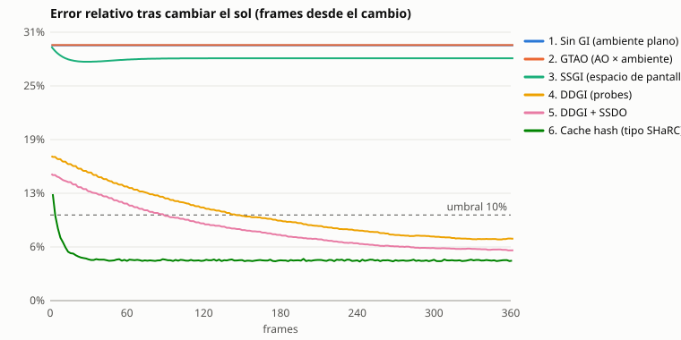

Las curvas que no se ven quedan exactamente debajo de otra (p. ej. 1 y 2, con el mismo error). La tabla de arriba tiene los valores.

**Piso de ruido de la referencia** (2048 spp, estimado con una segunda referencia independiente): RMSE ≈ 3.54e-4, error relativo ≈ 1.0 %. Diferencias entre métodos por debajo de ese nivel no son significativas.

**Parámetros calibrados contra la referencia** (búsqueda en grilla, mínimo error relativo medio en las 5 cámaras): ambiente de "Sin GI" = 0.004, ambiente de GTAO = 0.004, SSGI: ambiente = 0.004, escala GI = 8. Es un ajuste con oráculo que favorece a esos métodos; los métodos con rayos no se calibraron.
<!-- BENCH:END -->

### Galería

Imágenes finales (exposición 4, ACES) y mapas de diferencia `|ΔY|` contra la referencia (ganancia 4), cámaras 1 y 4. Generadas por `npm run bench` en `results/images/`.

**Cámara 1. Atrio**

| Método | Final | Diferencia |
|---|---|---|
| Referencia (2048 spp) | 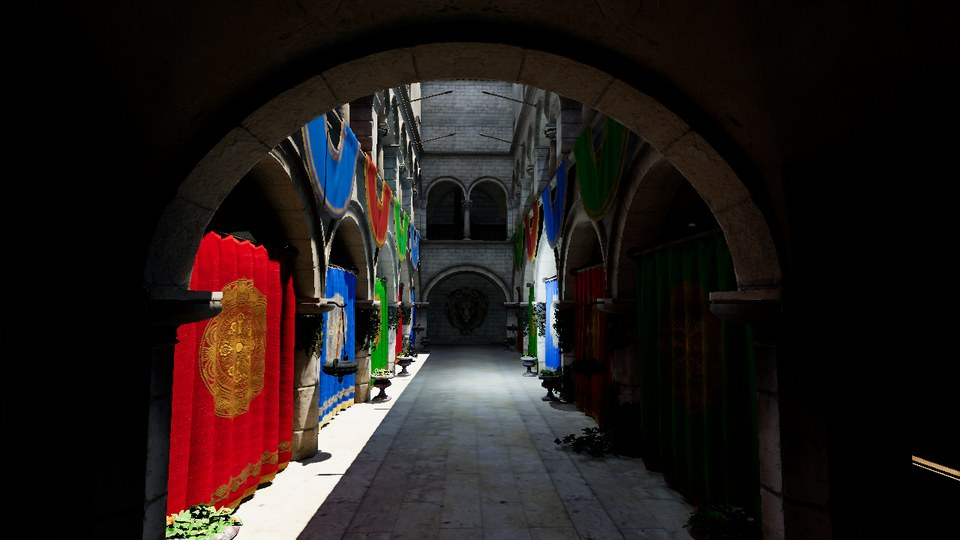 |  |
| 1. Sin GI |  | 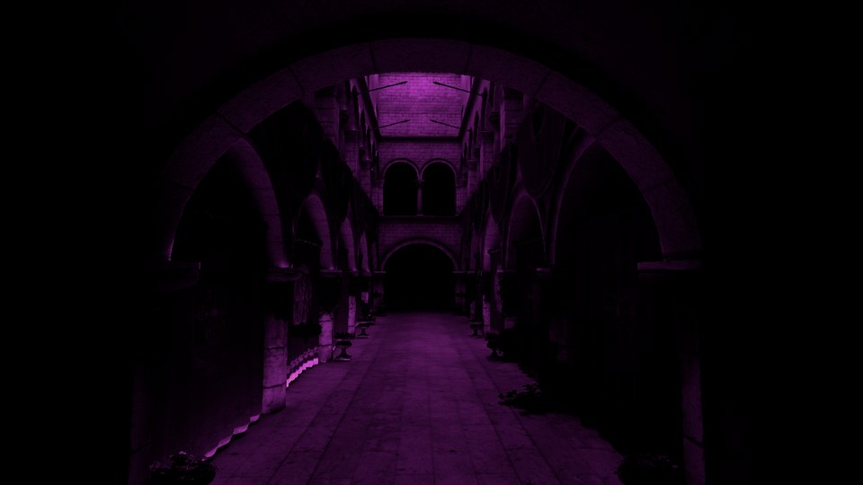 |
| 2. GTAO | 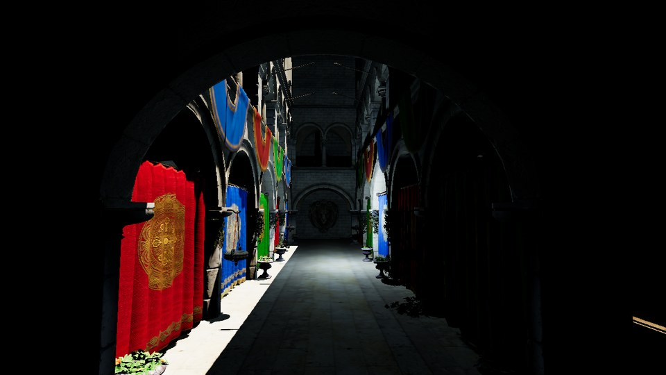 |  |
| 3. SSGI | 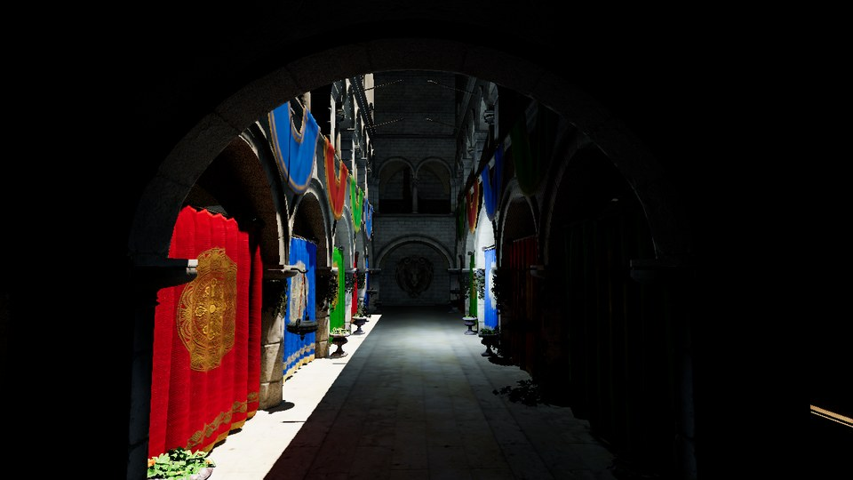 | 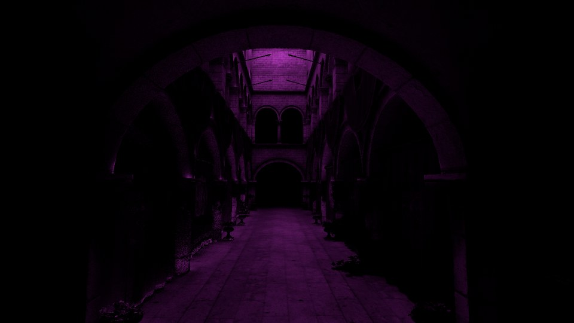 |
| 4. DDGI | 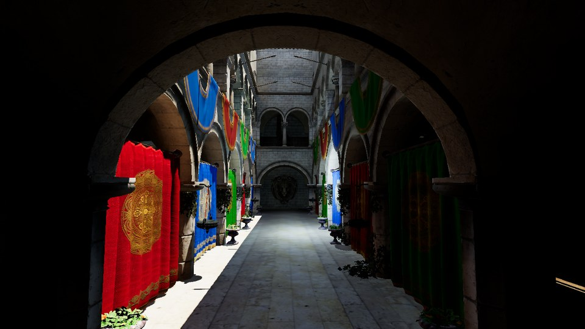 | 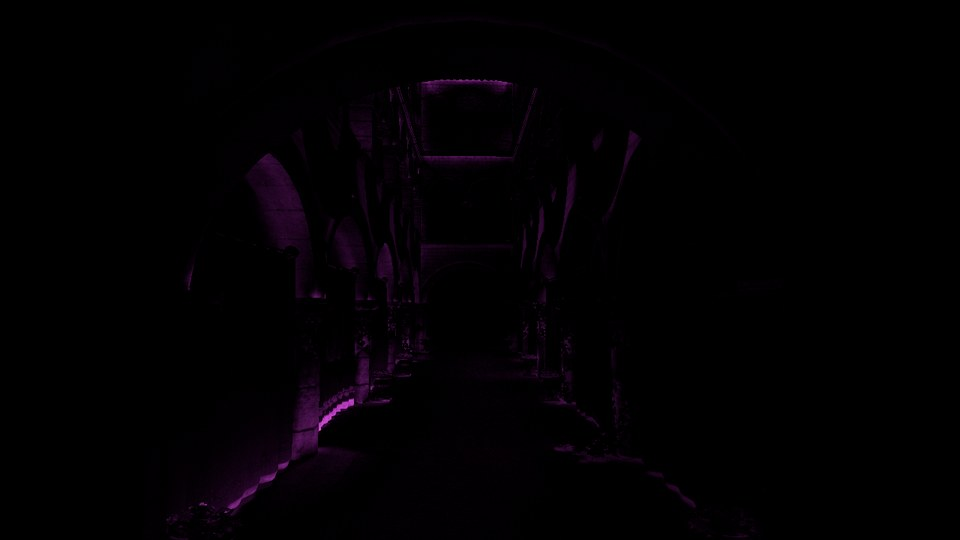 |
| 5. DDGI + SSDO |  | 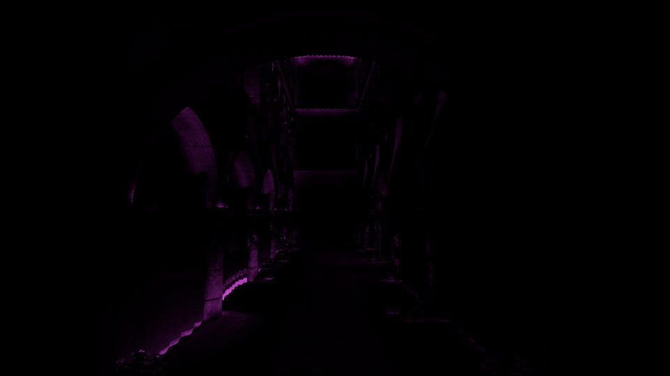 |
| 6. Cache hash | 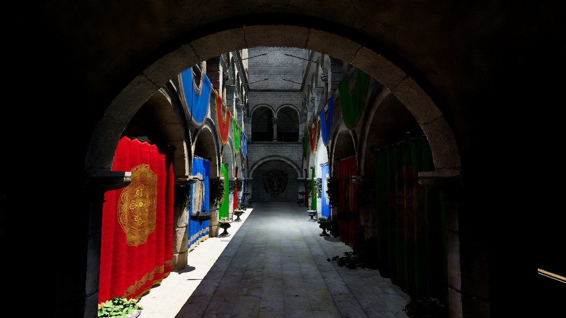 | 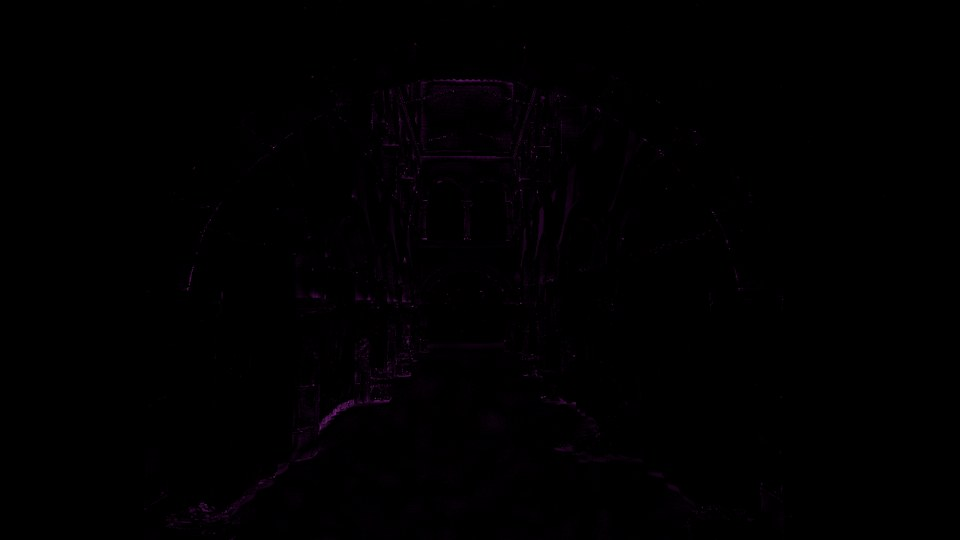 |

**Cámara 4. Cortinas**

| Método | Final | Diferencia |
|---|---|---|
| Referencia (2048 spp) | 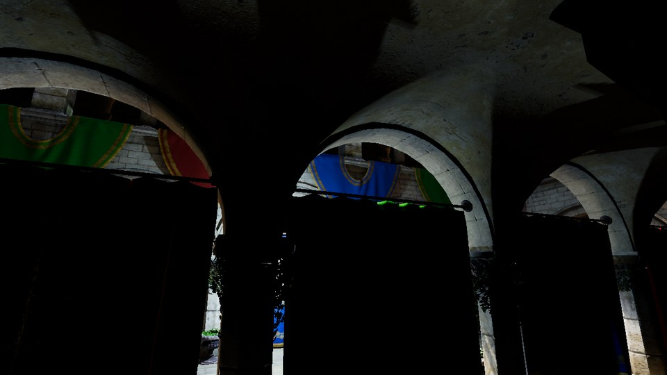 |  |
| 1. Sin GI |  | 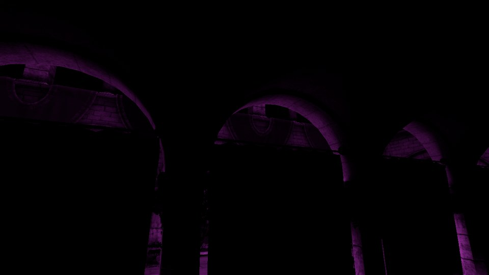 |
| 2. GTAO |  |  |
| 3. SSGI | 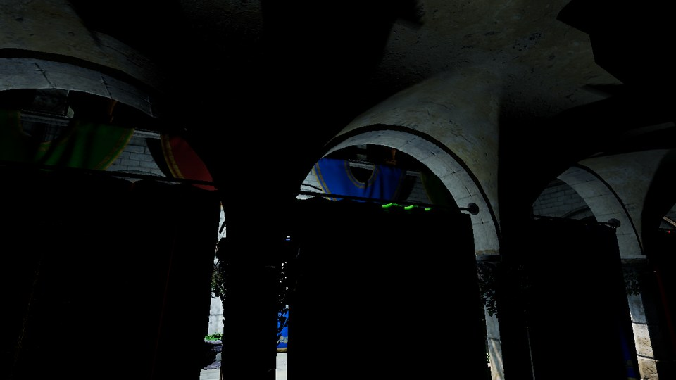 | 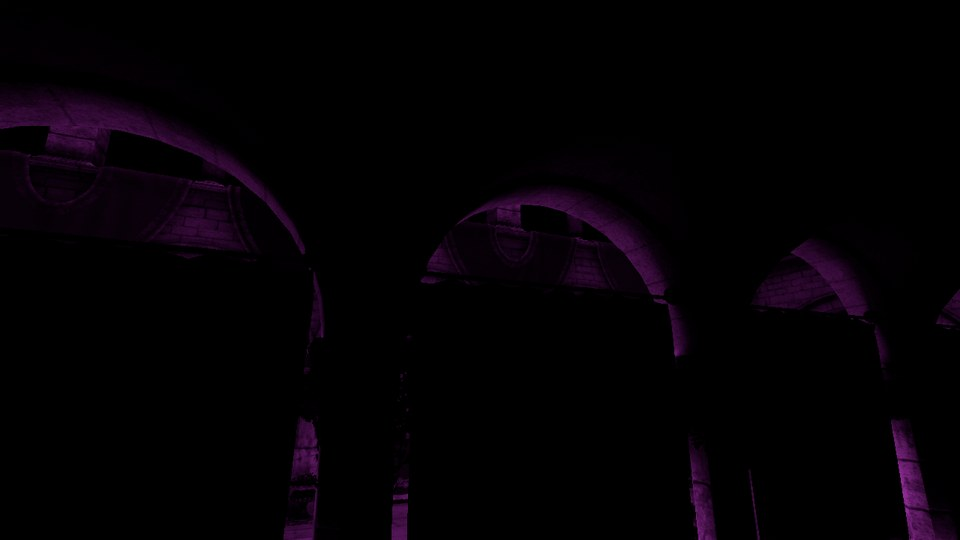 |
| 4. DDGI | 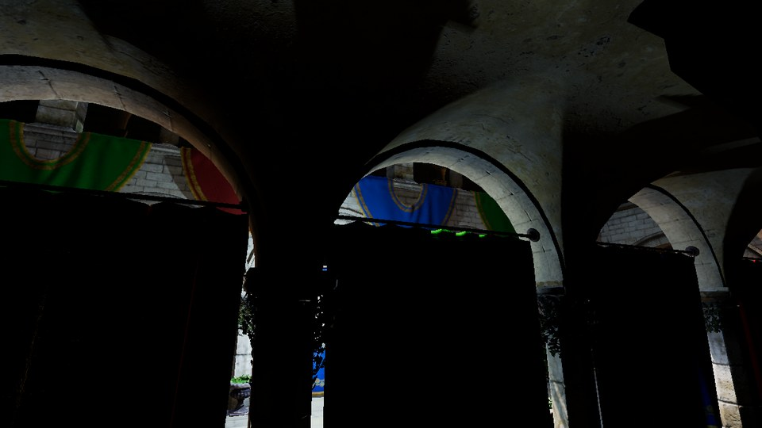 | 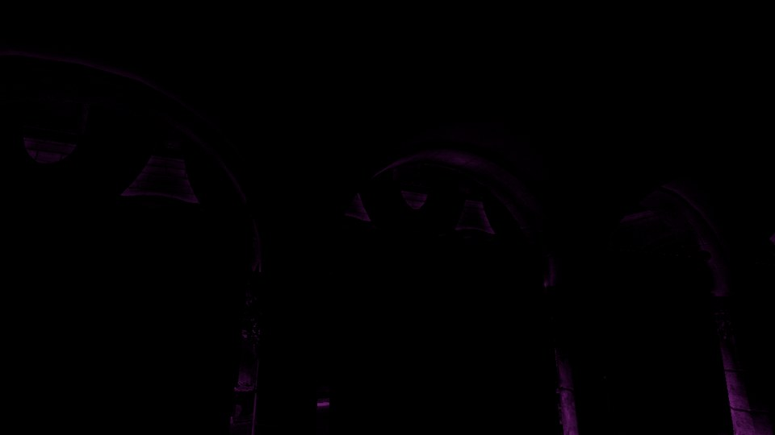 |
| 5. DDGI + SSDO | 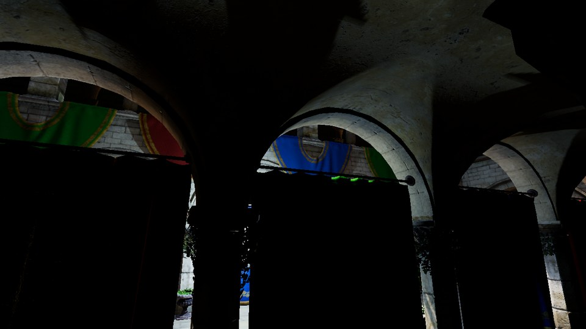 | 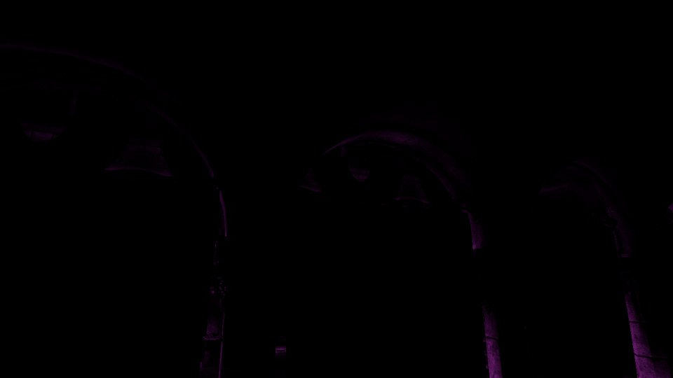 |
| 6. Cache hash |  | 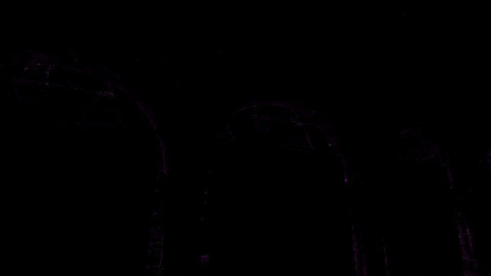 |

